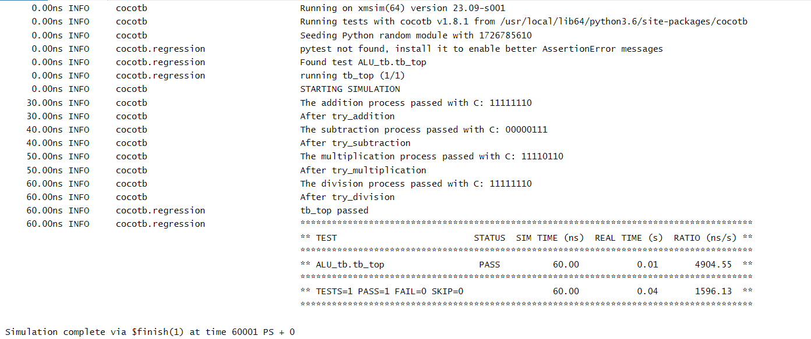

# Introduction to Cocotb testbenches using python
Cocotb (Coroutine-based co-simulation testbench) is a powerful open-source framework for verifying digital designs, particularly those described in Hardware Description Languages (HDLs) like VHDL and Verilog. By leveraging Python's capabilities, Cocotb allows for a flexible and user-friendly way to write testbenches, making it easier for engineers to verify the functionality of their designs.

**Key Features of Cocotb :**

- Python Integration: Cocotb utilizes Python, enabling engineers to write testbenches in a high-level language that is familiar to many. This reduces the learning curve for those already proficient in Python.

- Coroutines: Using Python's coroutine capabilities, Cocotb allows for asynchronous testbench execution, which can model real-world timing and events more naturally than traditional HDL testbenches.

- Ease of Use: Writing testbenches in Python can significantly streamline the verification process. With built-in support for complex data types, random stimulus generation, and easy-to-use logging and reporting, engineers can quickly set up and run simulations.

- Interoperability: Cocotb works with various simulators, including ModelSim, XSIM, VCS, and more, allowing for versatility across different environments.

- Rich API: Cocotb provides a comprehensive API for managing simulations, enabling users to easily control simulation time, trigger events, and interact with HDL designs.

**Basic Structure of a Cocotb Testbench :**

A typical Cocotb testbench consists of several key components:

- DUT (Design Under Test): The HDL module being tested.
- Coroutine Functions: These define the test scenarios and are decorated with @cocotb.coroutine or simply use async def.
- Simulations: A testbench is executed by a simulator that runs the defined coroutines.

# Example Testbench

we use cocotb testbench using python to test ALU design main 4 functions (ADD , SUB , DIV , MULT) and to use this method to verify my design we need to define 3 files 

## firstly (ALU (Design file))

- there is my design to test it

## Secondly (Makefile)

- Build Automation: It automates the compilation of the HDL (Hardware Description Language) files, such as VHDL or Verilog, ensuring that the simulation environment is set up correctly.

```
gui?=1
TOPLEVEL_LANG ?= verilog
SIM ?=xcelium   
PWD=$(shell pwd)
ifeq ($(TOPLEVEL_LANG),verilog)
    VERILOG_SOURCES = $(PWD)/ALU.sv
else ifeq ($(TOPLEVEL_LANG),vhdl)
    VHDL_SOURCES = $(PWD)/counter.vhdl
else
    $(error A valid value (verilog or vhdl) was not provided for TOPLEVEL_LANG=$(TOPLEVEL_LANG))
endif
TOPLEVEL := ALU             #Module_NAME
MODULE   := ALU_tb     #File_Python_Name
# SIM_ARGS ?= -gui
include $(shell cocotb-config --makefiles)/Makefile.sim 
```

## Third (cocotb testbench)

**Output From running this testbench :**



*Figure 1: output*


